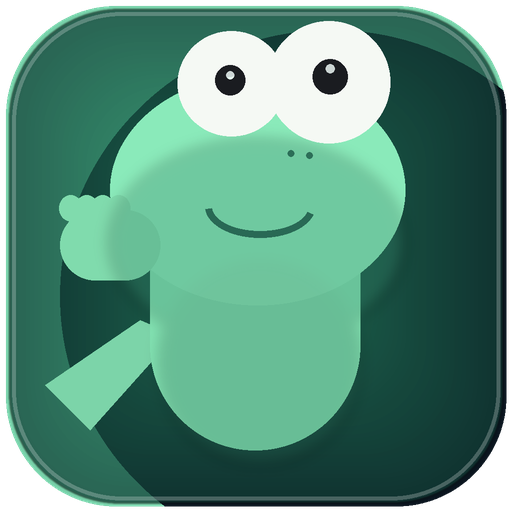

<div align="center">

# 🦎 Lizard Companion for macOS

An expressive menu bar pet that reacts to what you're doing on your Mac.

<p>
  
</p>

<p>
  
  
  
</p>

<p>
  
  
  
</p>

</div>

---

## Features

- Animated companion in your menu bar (not a static icon)
- Context-aware states for real workflows
- Dashboard window with app/category time tracking (today and last 7 days)
- Safari and Comet website tracking by domain inside the dashboard
- Spotify reaction mode with just-in-time permission request
- Calendar reminder reactions
- Battery-aware animation throttling for better efficiency
- Rich clip catalog with app-specific expressions

## Branding

- New app icon: Tom-inspired portrait with open protruding eyes for strong small-size readability.

<p align="center">
  
</p>

## App-Aware States

The companion adapts to app categories and specific apps on your Mac:

- Coding: Xcode, Cursor, Terminal, iTerm, Warp
- Git sync: GitHub Desktop
- AI assistants: ChatGPT, Codex, Claude, LM Studio, Ollama
- Meetings: Microsoft Teams, Outlook
- Productivity docs: Word, Pages, Keynote, PowerPoint
- Spreadsheets: Excel, Numbers
- Browser/research: Safari, Chrome, Firefox, Perplexity
- Communication: Discord, Telegram, WhatsApp
- Racing/media: MultiViewer
- Security: NordVPN, Tailscale
- Launcher: Raycast

## Animation Catalog

Core clips:

- `idle_blink`, `sleep`
- `code_mac`, `code_terminal`, `code_cursor`
- `music_headphones`, `battery_worry`, `charge_recover`
- `meeting_wave`, `meeting_urgent`
- `browse_think`, `chat_talk`

Extended clips:

- `celebrate_fireworks`, `focus_deep`, `notify_ping`
- `compile_wait`, `break_stretch`
- `ai_assistant`, `meeting_call`
- `docs_write`, `sheet_crunch`
- `launch_fast`, `racing_watch`, `github_sync`, `secure_shield`

<p align="center">
  
</p>

## Install (No Xcode Required for Daily Use)

You only need Xcode once to build. After that, run like a normal app from `/Applications`.

```bash
sudo xcode-select -s /Applications/Xcode.app/Contents/Developer
cd "Menu bar Companion app"
xcodebuild -scheme "Menu bar Companion app" -configuration Release -derivedDataPath build clean build
cp -R "build/Build/Products/Release/Menu bar Companion app.app" /Applications/
open /Applications/"Menu bar Companion app.app"
```

If macOS blocks first launch: right-click app in `/Applications` -> **Open**.

## Download

For end users, use the ZIP from GitHub Releases:

- Recommended download: [LizardCompanion-macOS.zip](https://github.com/zabrodsk/lizard-companion-macos/releases/latest/download/LizardCompanion-macOS.zip)
- ZIP checksum: [LizardCompanion-macOS.zip.sha256](https://github.com/zabrodsk/lizard-companion-macos/releases/latest/download/LizardCompanion-macOS.zip.sha256)
- Releases page: [github.com/zabrodsk/lizard-companion-macos/releases](https://github.com/zabrodsk/lizard-companion-macos/releases)
- Unzip and drag the app into `/Applications`

If the latest release is notarized, macOS should open it normally after unzip. If an older release is blocked, run:

```bash
xattr -dr com.apple.quarantine /Applications/"Menu bar Companion app.app"
open /Applications/"Menu bar Companion app.app"
```

## Dashboard Tracking

The dashboard tracks frontmost app time and, when enabled, browser domain time for supported browsers:

- Browser support: Safari and Comet
- Website tracking is off by default and must be enabled in settings
- Domain tracking only runs while the browser is frontmost
- The dashboard stores domains, not full page URLs

Website tracking uses Apple Events and may prompt for permission the first time you enable it.

### Maintainer Release Flow

To build and upload the current ZIP release locally:

```bash
./scripts/release-local.sh v0.1.2
```

This flow:

- Builds Release app
- Notarizes + staples app when credentials are configured
- Creates ZIP + SHA256 files
- Uploads both assets to the provided GitHub release tag

If you omit the tag, it just writes artifacts locally into `dist/`.

To produce a notarized ZIP, set:

```bash
export SIGN_IDENTITY="Developer ID Application: Your Name (TEAMID)"
# Option A (recommended): keychain profile
export NOTARYTOOL_PROFILE="your-notary-profile"
# Option B: Apple ID credentials
# export APPLE_ID="you@example.com"
# export APPLE_APP_SPECIFIC_PASSWORD="xxxx-xxxx-xxxx-xxxx"
# export APPLE_TEAM_ID="TEAMID"
```

If you only want local artifacts and no upload:

```bash
./scripts/release-local.sh
```

This creates:

- `dist/LizardCompanion-macOS.zip`
- `dist/LizardCompanion-macOS.zip.sha256`

For the full release process, GitHub Actions secrets, and verification steps, see [docs/release.md](docs/release.md).

## Permissions

The app requests permissions only when related features are enabled:

- Apple Events: Spotify playback state
- Apple Events: Safari and Comet current website domain
- Calendar: upcoming meeting reminders

## Battery Impact

Animation is lightweight (tiny pixel frames), and the app includes power-aware throttling:

- Slower animation when unplugged
- Stronger slowdown on low battery
- Subtle mode now uses calmer defaults to reduce constant movement
- Usage tracking runs on a lightweight 1-second frontmost-app sampler

## Project Structure

```text
Menu bar Companion app/
├─ Menu bar Companion app.xcodeproj/
├─ Menu bar Companion app/
│  ├─ Companion/
│  │  ├─ Animation/
│  │  ├─ Engine/
│  │  ├─ Models/
│  │  ├─ Services/
│  │  └─ UI/
│  └─ Assets.xcassets/
└─ README.md
```

## Roadmap

- Notch/desktop cameo mode (optional)
- More character packs and themes
- Additional integrations (tasks, git, notifications)
- DMG polish and release UX improvements

## License

MIT — see [LICENSE](LICENSE)
